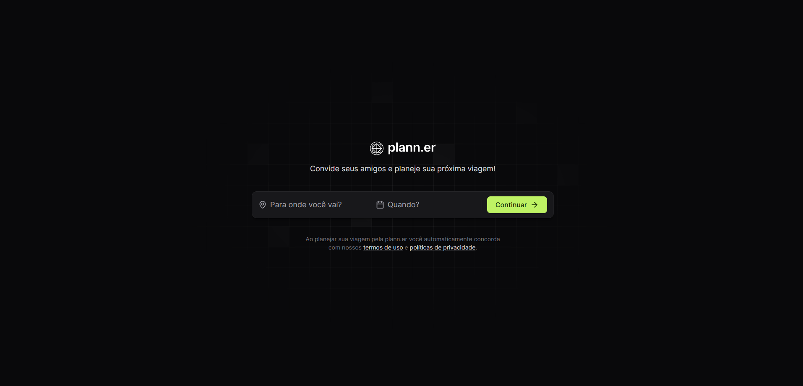
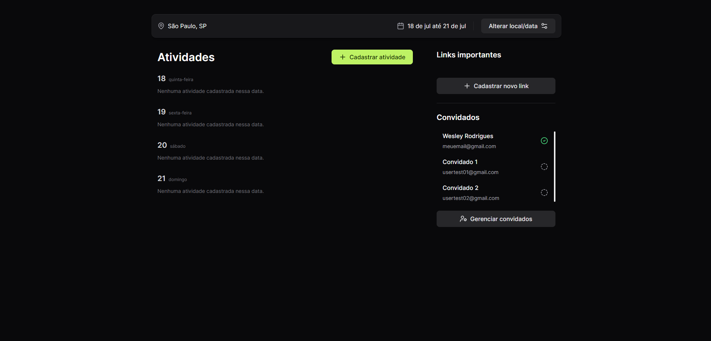

## What is the project?

NLW Journey Event Rocketseat's Reactjs Trail,

 Development of a front-end application in ReactJS, application of the concepts of Properties, States and Components, typing with Typescript, tooling with Vite, responsive interface with TailwindCSS, consumption API Node.js, calendar picker.

The application consists of being able to create or schedule an event and add people on that trip.


## Project Images





## Requirements for the project

- [NodeJS](https://nodejs.org/en) - Recommended latest version
- npm (installed along with Node)


## Getting Started

ATTENTION:
The project has a dependency on a backend. The backend repository can be found at the following link: [backend project](https://github.com/WesleyRodrigues55/backend-nlw-journey-plan.ner)

1. Clone the repository.
    ```sh
    git clone https://github.com/WesleyRodrigues55/frontend-nlw-journey-plann.er.git
    ```

2. Open the cloned project.
    ```sh
    cd frontend-nlw-journey-plann.er
    ```

3. Run the command.
    ```sh
    npm install
    ```

4. After installing the dependencies, run the command below to start the server.
    ```sh
    npm run dev
    ```


